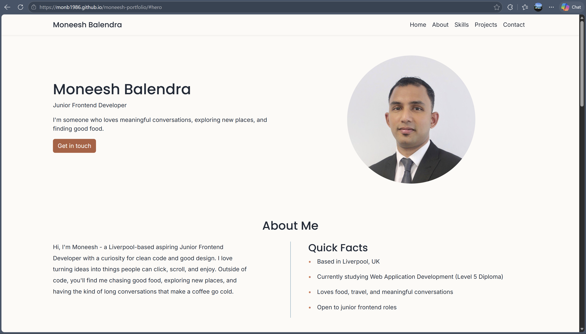
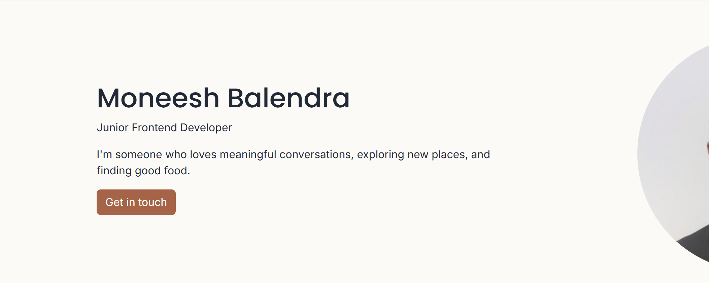
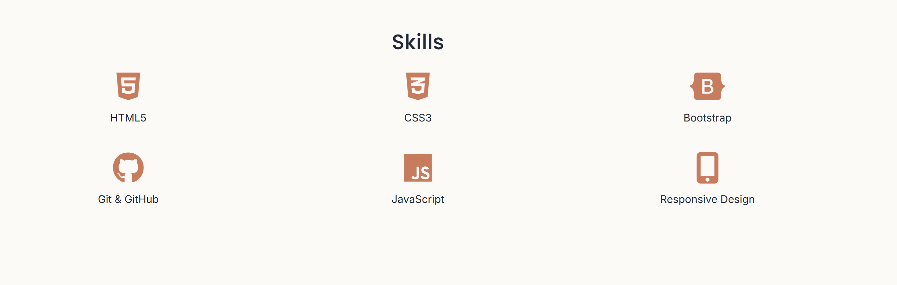
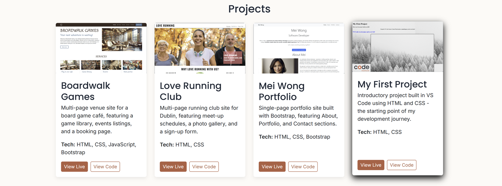
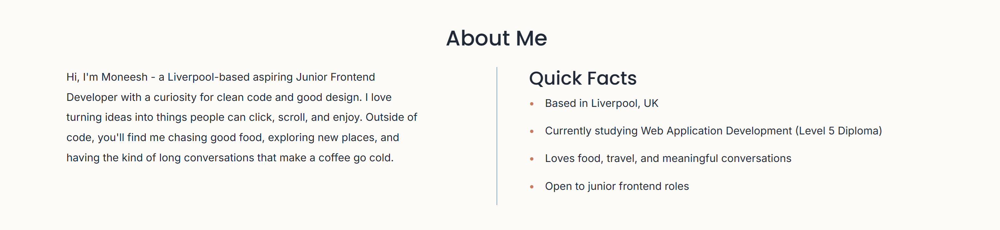
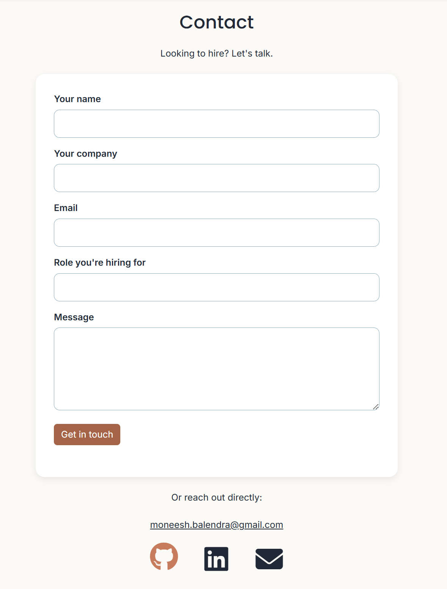
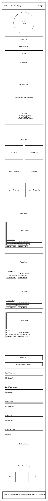
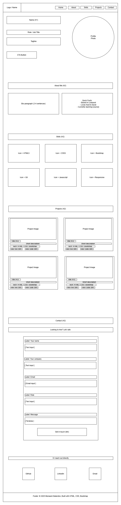
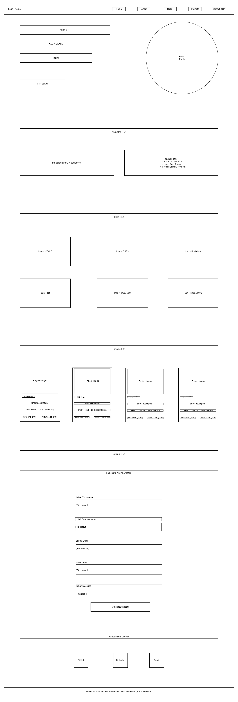

# Moneesh Balendra - Junior Frontend Developer Portfolio

A single-page portfolio website built to help recruiters quickly evaluate me as a candidate for Junior Frontend Developer roles.

**Live site:** https://monb1986.github.io/moneesh-portfolio/

## Project overview

This portfolio was built as Milestone Project 1 for the City of Bristol College Gateway Level 5 Web Development Diploma (Unit 1: User Centric Front-End Development). It is a single-page scrolling site presenting my background, skills, projects, and contact information.

The site is designed specifically for recruiters evaluating candidates for Junior Frontend Developer roles. Coming from a recruitment background myself, I designed the site to be straightforward, easy to scan, and self-explanatory - the qualities I would want when reviewing candidates' work under time pressure. The design is intentionally simple and effective, with a clean layout that highlights the most important information without distraction.

## User stories

The site was designed around five user stories, each representing a recruiter's needs:

1. **As a recruiter, I want to understand who the candidate is and what role they are looking for within 10 seconds**, so I can decide quickly whether to investigate further. *Solved by the hero section with name, role tagline, photo, and a primary call-to-action above the fold.*

2. **As a recruiter, I want to see the candidate's technical skills at a glance**, so I can assess whether they match the requirements I am hiring for. *Solved by the Skills section with icon and label cards in a responsive grid.*

3. **As a recruiter, I want to see examples of work the candidate has built**, so I can evaluate the quality and range of their work. *Solved by the Projects section with image, title, description, tech tags, and live and code links per card.*

4. **As a recruiter, I want to get a sense of the candidate as a person**, so I can judge whether they would fit the team. *Solved by the About section with bio paragraph and Quick Facts.*

5. **As a recruiter, I want to be able to contact the candidate easily and find them on LinkedIn or GitHub**, so I can progress to contact them freely without issues. *Solved by the Contact section with a hire-me form, direct email link, and three social links (GitHub, LinkedIn, email).*

## Wireframes

Wireframes were created in draw.io for three breakpoints during the planning phase (Stage 2), before any code was written. Each wireframe was validated against the five user stories to confirm the proposed layout would solve the recruiter's needs at every screen size.

### Mobile (375px)

*Note: The mobile wireframe shows the profile photo above the name. During responsive testing in Stage 6, the DOM order was revised so the name appears first, supporting better reading hierarchy and screen reader navigation. The wireframe represents the original design intent; the final build reflects user-centric refinements made during testing.*

### Tablet (768px)

### Desktop (1280px)

## Features

### Navigation
A sticky top navigation bar with anchored links to each section, allowing recruiters to jump between sections without scrolling back to the top. On mobile, the navigation collapses to a hamburger menu that auto-closes when a link is clicked.

### Hero section
Headshot, name, role ("Junior Frontend Developer"), a short personal tagline, and a primary call-to-action button linking to the Contact section. Designed to communicate the essentials within the recruiter's first few seconds on the page.

### About section
A bio paragraph alongside a Quick Facts list covering location, current study, interests, and availability. A subtle vertical divider visually pairs the two columns on desktop, while they stack cleanly on mobile and tablet.

### Skills section
Six core skill icons in a responsive grid (HTML5, CSS3, Bootstrap, Git and GitHub, JavaScript, Responsive Design). Each icon scales subtly on hover to invite engagement. Descriptions about each skill positioned next to the relevant skill icon. 

### Projects section
Four project cards, images and examples of live projects that I have done as part of the course so far, each with a thumbnail image, title, description, tech stack, and two action links ("View Live" and "View Code"). Cards lift gently on hover. At XL viewport widths, the row is capped to prevent the cards sprawling.

### Contact section
A hire-me form with name, company, email, role, and message fields (the first and last being required). Below the form, a direct email link and three social icons (GitHub, LinkedIn, email) for additional contact methods. Contact form designed with validation feedback to the user.

### Footer
Simple copyright line, palette-consistent with the rest of the site.

## Design decisions

### Colour palette - "Coastal Warmth"

| Colour | Hex | Use |
|---|---|---|
| Warm cream | `#FDFAF6` | Page background |
| Deep slate | `#1F2937` | Body text, headings, link colour |
| Warm coral | `#D97757` | Decorative accents (custom bullets) |
| Coral dark | `#B55E40` | Buttons, interactive elements (meets WCAG AA) |
| Dusty blue | `#7BA7BC` | Form focus glow, About section divider |

The palette was chosen with two priorities: I wanted users to feel welcomed to the page, and I wanted colours that were easy on the eyes while still highlighting the important parts of the site. Coming from a recruitment background myself, I felt this site needed to be very straightforward for recruiters to use and navigate, so the colour scheme intentionally keeps focus on the content rather than competing with it.

### Typography

- **Poppins** (Google Fonts) - used for all headings. Geometric, modern, and assertive without being aggressive.
- **Inter** (Google Fonts) - used for body text. Highly readable at every size, designed for screen use.

### Layout

A single-page scrolling layout was chosen over multi-page navigation because recruiters typically spend very little time on each candidate. A single scroll surface presents everything they need without forcing additional clicks. Anchor links in the sticky navigation allow direct jumps to specific sections.

### Future-readiness

The site was built with maintainability in mind - CSS custom properties (variables) for all palette colours, semantic HTML throughout, and Bootstrap utility classes layered with custom CSS in clearly commented sections. This makes future updates straightforward.

## Technologies used

### Languages
- **HTML5** - semantic markup throughout
- **CSS3** - custom styling with CSS custom properties for palette consistency
- **JavaScript** - a small snippet to handle mobile navbar collapse on link click

### Frameworks and libraries
- **Bootstrap 5.3.3** - responsive grid, utility classes, navbar component, collapse plugin
- **Google Fonts** - Poppins (headings) and Inter (body)
- **Font Awesome 6.5.2** - skill icons and social link icons

### Tools
- **VS Code** - primary development environment
- **Git and GitHub** - version control and remote hosting
- **Chrome DevTools** - responsive testing, layout debugging, accessibility inspection
- **draw.io** - wireframe creation
- **WebAIM Contrast Checker** - WCAG colour contrast validation
- **W3C HTML Validator** and **Jigsaw CSS Validator** — markup and style validation
- **GitHub Pages** - deployment

## Testing

A full record of testing performed across the project is documented in [TESTING.md](TESTING.md), with entries for each development stage.

The testing approach combined:
- Manual visual inspection at every breakpoint as the site was built
- Iterative testing of each change across all four target breakpoints (375px, 768px, 1024px, 1440px+) to confirm no regressions
- Automated validation using W3C and Jigsaw tools
- WCAG 2.1 AA compliance testing using the WebAIM Contrast Checker
- Keyboard navigation testing for accessibility
- Cross-section spacing and visual cohesion review

Validation evidence (screenshots from W3C HTML Validator and Jigsaw CSS Validator) is available in the [testing-evidence/](testing-evidence/) folder.

### Validation results
- **HTML:** 0 errors, 0 warnings
- **CSS:** 0 errors, 34 informational warnings (all relating to the Jigsaw validator's known inability to statically check CSS custom property values - not code issues)

### Accessibility
The site meets WCAG 2.1 AA compliance. All text-on-background colour combinations have been tested for contrast, semantic HTML5 elements structure the page, all interactive elements are keyboard-navigable with visible focus indicators, and all icon-only links carry `aria-label` attributes for screen reader users.

## Deployment

This site is deployed using **GitHub Pages**, hosted directly from the repository's `main` branch.

### To view the live site
Visit: https://monb1986.github.io/moneesh-portfolio/

### To deploy your own copy
1. Fork or clone this repository
2. In the GitHub repository settings, navigate to the **Pages** section
3. Under "Source," select the `main` branch and the `/ (root)` folder
4. Click **Save**
5. After a short delay, GitHub will provide a URL where the site is live

### To run locally
1. Clone the repository: git clone https://github.com/MonB1986/moneesh-portfolio.git
2. Open the project folder in your editor
3. Open `index.html` directly in a browser, or use a local server such as VS Code's Live Server extension

## AI assistance declaration

AI tools (Claude, Chat GPT and Co-pilot) were used in this project as a coaching aid. AI usage followed the course director's guidance: "Use AI to enhance your understanding, not replace it."

Specifically:
- **AI was used for:** explaining concepts (CSS variables, Flexbox order, responsive design patterns, ARIA attributes, WCAG compliance), code review and feedback, debugging help, structural scaffolding for testing documentation, and drafting documentation (this README) for verification and customisation.

A small JavaScript snippet for the hero CTA scroll behaviour was generated with AI assistance after a layout conflict could not be resolved with CSS alone. This was approved by the course director and is attributed in the source.

- **AI was not used for:** writing the HTML or CSS itself, making design decisions, performing tests, or replacing my judgement on what to build.

All code in this repository was written by me. All design decisions and creative choices are my own. All testing was performed by me. The Bootstrap navbar collapse JavaScript snippet was adapted from previous course material (Code Institute, Module 10) and is attributed in the source.

This declaration is included in line with industry practice around transparent AI tool usage in professional development workflows.

## Credits and attribution

### Course
- **City of Bristol College** - Gateway Level 5 Web Development Diploma, Unit 1: User Centric Front-End Development
- **Code Institute Module 10** - source of the adapted JavaScript snippet for mobile navbar auto-collapse

### Fonts
- **Poppins** and **Inter** - Google Fonts

### Icons
- **Font Awesome 6.5.2** - all icons used in the site

### Framework
- **Bootstrap 5.3.3** - responsive grid, utility classes, components

### Images
- **Profile photo:** personal photograph
- **Project thumbnail images:** sourced from [Unsplash](https://unsplash.com) under the Unsplash License (free to use, attribution appreciated)

### Acknowledgements
Thanks to my course director and tutors at City of Bristol College for guidance throughout the project.

## Future improvements

Planned enhancements for future iterations:

- **Real project screenshots** replacing the current placeholder thumbnail images, once the projects themselves are complete
- **Live project links** - replacing the current `example.com` placeholders with actual deployed project URLs
- **Working contact form** - currently uses a `mailto:` link, which opens the user's email client. A future version could integrate with a form service (Formspree, Netlify Forms, or similar) so submissions are received directly
- **Animation on scroll** - subtle fade-in or slide effects as sections enter the viewport, adding polish without compromising accessibility
- **Active navigation indicator** - highlighting the current section in the nav as the user scrolls. Three approaches were investigated (documented in TESTING.md) but not implemented due to cross-browser limitations and time constraints. A custom Intersection Observer implementation, with section markup adjusted to give each section a more consistent height, would be the recommended approach for a future iteration.
